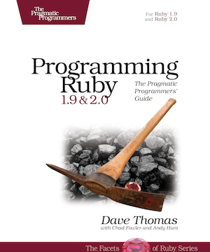

[](https://gitpitch.com/enogrob/ebook-project/master)
```
Roberto Nogueira  
BSd EE, MSd CE
Solution Integrator Experienced - Certified by Ericsson
```
# eBook Ruby Programming



**About**

Learn everything you need to about the subject of this `eBook` project.

[Homepage](https://imagery.pragprog.com/products/355/ruby4.jpg?1378671145)

## Topics
```
Facets of Ruby
[x] Getting Started
[ ] Ruby.new
[ ] Classes, Objects, and Variables
[ ] Containers, Blocks, and Iterators
[ ] Sharing Functionality: Inheritance, Modules, and Mixins
[ ] Standard Types
[ ] Regular Expressions
[ ] More About Methods
[ ] Expressions
[ ] Exceptions, catch, and throw
[ ] Basic Input and Output
[ ] Fibers, Threads, and Processes
[ ] Unit Testing
[ ] When Trouble Strikes!
Ruby in Its Setting
[ ] Ruby and Its World
[ ] Namespaces, Source Files, and Distribution
[ ] Character Encoding
[ ] Interactive Ruby Shell
[ ] Documenting Ruby
[ ] Ruby and the Web
[ ] Ruby and Microsoft Windows
Ruby Crystallized
[ ] The Ruby Language
[ ] Duck Typing
[ ] Metaprogramming
[ ] Reflection, ObjectSpace, and Distributed Ruby
[ ] Locking Ruby in the Safe
Ruby Library Reference
[ ] Built-in Classes and Modules
[ ] Standard Library
```
